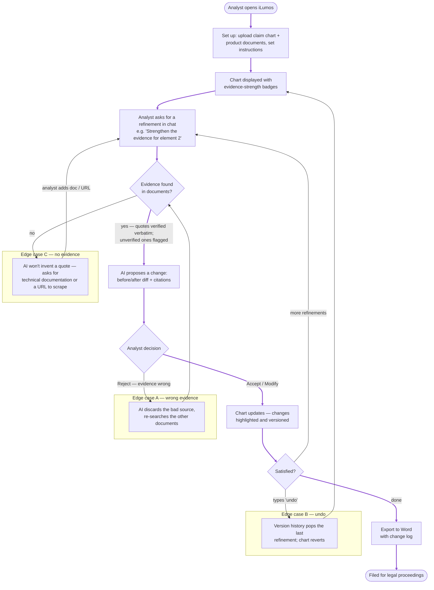

# User Flow — iLumos Claim Chart Refinement (Deliverable 1)

The diagram covers the full analyst journey — upload → conversational refinement →
AI suggestions → review/iterate → export — plus the three required edge cases:
**(A)** AI gives wrong evidence and the analyst corrects it via chat, **(B)** the analyst
undoes a previous refinement, **(C)** the AI cannot find evidence and asks the analyst
for technical documentation or a URL to scrape.

> **Ready-made image for submission:** [`docs/diagrams/user_flow.png`](diagrams/user_flow.png)
> (re-export it if this Mermaid source changes — see `docs/5_Handoff.md` §4).
> For a public link, paste the block below into https://mermaid.live → Share.

## Reading the flow

- **Main path** (violet trunk): set up → chart displayed → ask in chat → grounded AI
  proposal → analyst decides → chart updates with highlights → iterate → export to Word.
- **The analyst is always in control**: only an explicit Accept (or Modify-then-apply)
  touches the chart, every change is versioned, and "undo" reverts it (Edge case B).
- **No fabricated evidence**: quotes are verified verbatim against the uploaded documents;
  when nothing supports a request, the AI asks for a document or URL instead (Edge case C).
- **Corrections close the loop**: rejecting with a reason ("that quote is wrong") makes the
  AI discard the source and re-search the remaining documents (Edge case A).
