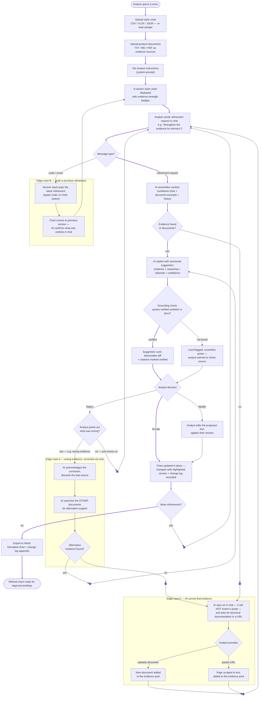

# User Flow — iLumos Claim Chart Refinement (Deliverable 1)

The diagram covers the full analyst journey — upload → conversational refinement →
AI suggestions → review/iterate → export — plus the three required edge cases:
**(A)** AI gives wrong evidence and the analyst corrects it via chat, **(B)** the analyst
undoes a previous refinement, **(C)** the AI cannot find evidence and asks the analyst
for technical documentation or a URL to scrape.

> **Ready-made image for submission:** [`docs/diagrams/user_flow.png`](diagrams/user_flow.png)
> (re-export it if this Mermaid source changes — see `docs/5_Handoff.md` §4).
> For a public link, paste the block below into https://mermaid.live → Share.

## Reading the flow

- **Main path** (thick violet trunk, top to bottom): setup → chart displayed → chat request →
  AI suggestion with grounding gate → analyst decision → chart updates with visible
  highlights → iterate → Word export. Small violet dots are junctions where loop-backs
  rejoin the trunk.
- **Every AI suggestion passes a grounding gate** before the analyst sees it: quotes that
  can't be found verbatim in the uploaded documents are visibly flagged, and a total lack
  of evidence routes to Edge case C instead of producing a fabricated citation.
- **The analyst is always in control**: nothing modifies the chart except an explicit
  Accept (or Modify-then-apply), and every applied change is one "undo" away (Edge case B).
- **Rejection is a fork**: a plain rejection simply continues the conversation, while a
  rejection that names the problem ("that quote is from the wrong doc") enters the
  correction loop (Edge case A) — the AI discards the bad source, re-searches the other
  documents, and either re-proposes or escalates to Edge case C.
