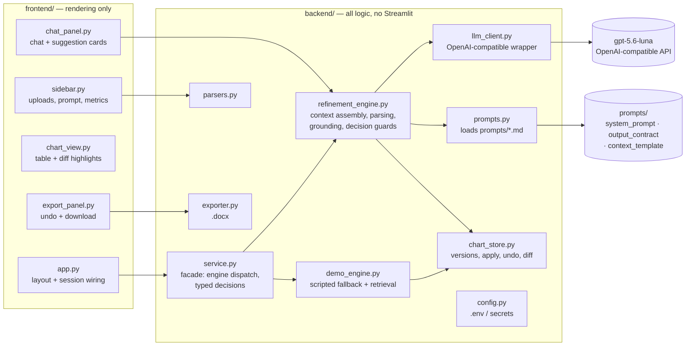

# Logic & Decisions — iLumos Prototype

Technical companion to the PRD: how the system works, why it's built this way, and a
running decision/change log. Updated with every meaningful change.

## 1. System architecture

Single Streamlit process. `frontend/` renders; `backend/` decides. The frontend never
imports the OpenAI SDK, parses a file, or mutates the chart directly — it calls backend
functions and displays their results. The backend never imports Streamlit.

**Session state (owned by frontend, typed by backend):** one `ChartStore` (chart +
version history), `docs: list[DocFile]`, `chat: list[ChatMessage]` (suggestions live
inside their assistant message, so card state survives reruns), `SessionMetrics`,
`system_prompt`, `demo_mode`.

## 2. The refinement loop

1. **Deterministic intents first.** Short imperative messages — "undo"/"revert" and
   "accept"/"reject (that)" — are regex-routed and handled without an LLM call: reverting
   or applying legal work must be instant, free, and 100% reliable. The guards fire only
   on messages of ≤4 words anchored at the start, so "don't undo anything, strengthen
   element 2" reaches the engine instead of destroying a version. Typed accept/reject
   resolves against the most recent pending suggestion.
2. **Context assembly** (`build_messages`): the system message is rendered from
   `prompts/context_template.md` — analyst-editable instructions
   (`prompts/system_prompt.md`) + the mandatory JSON output contract with a worked example
   (`prompts/output_contract.md`) + numbered chart + document excerpts (per-doc char cap)
   + last 8 chat turns, including the status of previously proposed suggestions
   (accepted/rejected) so the model learns the analyst's bar within the session. All
   prompts are versioned files in `prompts/` (see its README), never string literals.
3. **Structured output.** The model must return `{reply, suggestions[]}` where each
   suggestion has an action (`revise` / `add_row` / `needs_input`), target element number,
   proposed field values, rationale, confidence, and citations `{doc, quote}`. Parsing is
   tolerant (fenced/embedded JSON rescued); a model that ignores the contract degrades to
   a plain chat reply — never a crash.
4. **Grounding check** (`verify_citation`): each quote is whitespace/case-normalized and
   substring-matched against the named document. Quotes must carry substance (≥ 4 words
   and ≥ 20 characters) — a single common word matching somewhere is not verification.
   If the quote exists but in a *different* document than claimed, the attribution is
   corrected to the real source before the ✓ badge is shown; quotes found nowhere show
   "⚠ unverified quote — check source".
5. **Human-in-the-loop decision.** Accept applies the suggestion via `ChartStore` (new
   version + cell-level diff recorded); Modify opens editable fields pre-filled with the
   proposal — any deliberate edit, including clearing a field, wins over the AI's text —
   and Reject records the outcome and invites a correction message, which flows back as
   ordinary conversation (edge case A). Decisions are guarded: a non-pending suggestion
   is a no-op (double-click safe), and a suggestion orphaned by an undo is retired with
   an explanation instead of crashing — state and metrics mutate only after a successful
   apply.
6. **Metrics.** Every actionable suggestion increments `suggestions_made`; decisions
   update acceptance counts; grounded suggestions tracked separately. Shown live in the
   sidebar — the same numbers the PRD proposes as product success metrics.

## 3. Why a real retrieval demo engine (not canned replies)

Demo mode implements the same `EngineResponse` contract with a tiny keyword retriever:
document sentences are scored by keyword overlap against the target element + request,
and the best verbatim sentences become citations. Consequences:

- It works on **any** uploaded chart/docs, not just the sample — uploads stay demo-able.
- Its citations are grounded **by construction** (lifted verbatim), so the grounding badge
  is honest in both modes.
- "No evidence" arises **naturally** (no sentence scores ≥ 2), which triggers the same
  needs-input path as the live engine — edge case C didn't need to be faked.

Routing guards worth noting: a weak row is only used as a fallback target when it shares
at least one keyword with the request (or the request has no distinctive keywords at all)
— otherwise an off-topic request (e.g. "homomorphic encryption") would hijack an
unrelated weak row instead of honestly reporting "no evidence".

## 4. LLM limitations acknowledged (and what the design does about them)

| Limitation | Mitigation in this prototype |
|------------|------------------------------|
| Fabricated quotes/evidence | Verbatim grounding check + visible ⚠ flag; "no evidence" → needs-input, never invention |
| Malformed / non-JSON output | Tolerant extraction, graceful text fallback |
| Wrong target element | Suggestions carry the element number; revisions to unknown rows are dropped, not guessed |
| Context limits on large docs | Per-document char caps with visible "[truncated]" marker |
| Chat-history drift | Only last 8 turns sent, with suggestion outcomes summarized |
| API failures / quota | Error surfaces as a chat message with recovery options; demo mode always available |

## 5. Decision log

| # | Date | Decision | Rationale |
|---|------|----------|-----------|
| 1 | 2026-08-23 | Streamlit single-process; frontend/backend split by import direction | Fast hosted prototype; logic stays testable and portable to FastAPI later |
| 2 | 2026-08-23 | gpt-5.6-luna via OpenAI SDK with configurable `OPENAI_BASE_URL` | Cheap + capable; endpoint decided later without code change |
| 3 | 2026-08-23 | Structured JSON suggestions rendered as cards | Deterministic accept/reject, cell-level diffs, metrics |
| 4 | 2026-08-23 | Verbatim string grounding (not semantic similarity) | For legal evidence, "the quote exists" is the bar; similarity would bless paraphrases |
| 5 | 2026-08-23 | Snapshot-based versioning (full chart copy per refinement) | Charts are small; trivially correct undo beats clever deltas |
| 6 | 2026-08-23 | Demo engine = mini keyword retrieval, same contract as live engine | Honest fallback; grader always sees the full loop |
| 7 | 2026-08-23 | Undo is deterministic (regex), never delegated to the LLM | Reverting legal work must not depend on model behavior |
| 8 | 2026-08-23 | `.docx` export includes a change-log appendix | Analysts/counsel need to see what changed since the original chart |
| 9 | 2026-08-23 | All LLM prompts extracted to `prompts/` as versioned files, loaded by `backend/prompts.py` | Prompts are product surface: reviewable, editable without touching code; output contract isolated from the analyst-editable system prompt so edits can't break parsing |
| 10 | 2026-08-23 | Typed "accept"/"reject" resolve deterministically against the latest pending suggestion | The brief's "accept/reject/modify through continued conversation," satisfied literally as well as via buttons |
| 11 | 2026-08-23 | UI restyled to the iLumos brand (ilumos.ai): Figtree type, violet #b16cea → pink gradient identity, near-black ink, lilac tints, Lumenci-orange mark | The prototype should feel like the real product family it extends |

## 6. Change log (fixes during build)

| Date | Change | Why |
|------|--------|-----|
| 2026-08-23 | `config.py`: `load_dotenv` pinned to the project root `.env` | Default behavior walks up parent dirs; hit a permission-blocked file outside the project |
| 2026-08-23 | Demo engine: no-evidence detection when no row matches | "Strengthen evidence that <unsupported topic>" now asks for docs/URL instead of replying generically |
| 2026-08-23 | Demo engine: weak-row fallback gated by keyword affinity | Off-topic requests no longer hijack an unrelated weak row; they honestly report missing evidence |
| 2026-08-23 | `exporter.py`: removed dead style argument in change-log paragraphs | Code cleanliness |
| 2026-08-23 | **Audit round (41 findings, 6 role-matched reviewers + adversarial verification):** undo intent narrowed to short imperatives (was a data-loss false-positive); XML-invalid control chars stripped at parse + export (was a page-bricking crash); grounding minimums raised to ≥4 words / ≥20 chars with doc-name correction (was trivially gameable); decision guards for orphaned/double-clicked suggestions (was an uncaught crash + corrupted metrics); upload dedup keyed on file_id and reset on sample load (was silently eating re-uploads); Modify-form edits compared against seeds so deletions count; before/after diff given background chips (dark-theme legibility); export bytes cached per version (was rebuilt every rerun); view-layer logic moved behind ChartStore/exporter helpers; column mapping refuses partial alias+position mixes; URL fetch hardened (scheme case, content-type, private hosts) with pool dedup + remove controls; `.xls` dropped (xlrd never shipped); LLM client timeout 60s/1 retry; unlabeled demo fallback now announces itself; PRD typeset for one page + italics fixed in the converter | Every reviewer finding ≥ minor severity closed; both test suites extended with regressions and passing |
| 2026-08-23 | Prompts extracted to `prompts/` (system prompt, output contract with worked example, context template) + `backend/prompts.py` loader | User requirement: prompts reviewable in one place, enterprise-grade structure, rated ≥9/10 |
| 2026-08-23 | Brand restyle to ilumos.ai identity; user-flow diagram re-laid-out (straight highlighted trunk, junction dots, explicit reject fork) | Design parity with the real product; grader-reported label ambiguity fixed |
| 2026-08-23 | **UI v2 (final-product pass, per Abhinav):** sidebar removed — onboarding screen with a **3-case sample dropdown** (Acme thermostat, VoltEdge scooter, NimbusCam camera), then chart + tabbed right pane (Chat / Evidence / Settings); engine-status pill and demo toggle removed from UI (auto-fallback stays, labeled in chat); analyst instructions moved into Settings → Advanced expander (kept — the brief grades "setting system prompts"); tooltips on every control; export button degrades gracefully (disabled + hint) if python-docx is missing instead of crashing the page (root cause of the reported crash: app launched outside the venv) | Cleaner "final product" UI; sample dropdown enables instant testing without files; crash-proof export |

## 7. Verification

- `scripts/smoke_test.py` — 35 offline checks: full refinement loop, all 3 edge cases,
  grounding rigor (fabricated / single-word / misattributed quotes), undo-intent
  precision, orphaned-suggestion guards, typed accept, control-char sanitization,
  tolerant JSON parsing, CSV parsing, docx export, metrics.
- `scripts/ui_test.py` — 16 checks driving the real Streamlit app headlessly (AppTest):
  onboarding → sample load → chat → accept → highlight → undo-via-chat → needs-input.
- Both suites pass: **ALL PASSED**.

## 8. Known limitations (deliberate, prototype scope)

- No persistence: a browser refresh resets the session (Streamlit Cloud behavior).
- Keyword retrieval in demo mode is intentionally naive; the live engine does the real reasoning.
- URL fetch is a simple text scrape (no JS rendering).
- The grounding check validates that quotes exist, not that they *support* the claim —
  that judgment stays with the analyst by design.
